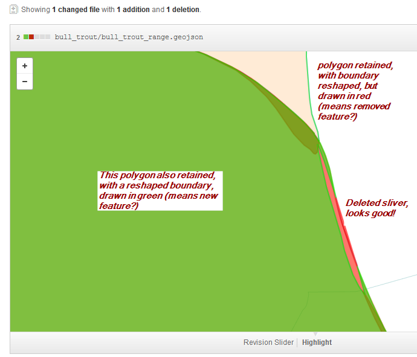

 
This should be easy,: *"locate global distribution map data for {species name}"*. All I get are piddly lo-res jpegs of unknown origin & WallsOfText". Why is this so hard in this grand interconnected world?

This was not created in MS Paint! Where's the data?



A couple of leads to follow up here: https://plus.google.com/116281795685893548599/posts/DX4bzacweYx
 
> **Note:** the data in this repo is *not* good or authoritative. Digitizing from a lo-res dumb bitmap like this is *not* how to do things. It's a band-aid, a stop-gap measure, and an experiment to explore Github as a geographic data store. If you arrived here looking for the real Bull Trout distribution range data, see the references in the thread noted above (for USA & BC), and for the Yukon Territory contact  "Fish and Wildlife, Fisheries", fisheries@gov.yk.ca and http://www.env.gov.yk.ca/animals-habitat/fish/fishspecies.php

### 2014-Feb-14

I traced from the bitmap above, converted to geojson using Calvin Metcalf's [esri2open](https://github.com/project-open-data/esri2open), modified range boundary within YT according to Fisheries biologists' instructions from 1:50k watershed data. Nutshell: add Liard River basin, remove Teslin Lake basin.

### 2014-Feb-17

This seems like a good opportunity to try out Github's new geo-diff feature. Result: very interesting, but not ready for prime time. This relatively small dataset (5mb) takes a long time to load via Github browser and is sluggish (and sometimes doesn't work at all).

The diff feature on the other hand is very cool, clearly showing where I cleaned up some gaps and slivers, though the depiction of a reshaped polygon needs some mental interpretation (drawn as "this polygon was deleted" when it should be "this polygon's boundary was changed"; maybe the object-id's changed?).

