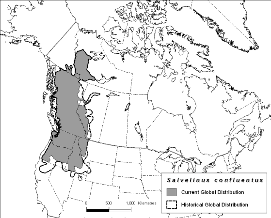

 
This should be easy,: *"locate global distribution map data for {species name}"*. All I get are piddly lo-res jpegs of unknown origin & WallsOfText". Why is this so hard in this grand interconnected world?

This was not created in MS Paint! Where's the data?



https://plus.google.com/116281795685893548599/posts/DX4bzacweYx
